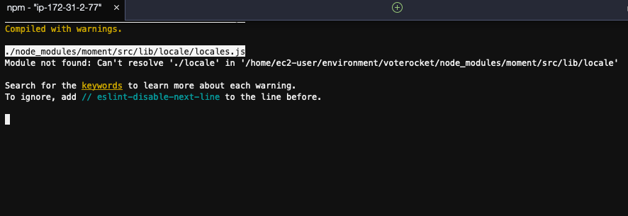

# Build a modern serverless web application in minutes using the AWS Amplify Framework

<p align="center">
  
</p>

This lab is provided as part of **[AWS Summit Online](https://aws.amazon.com/events/summits/online/)**.

ℹ️ You will run this lab in your own AWS account. Please follow directions at the end of the lab to remove resources to avoid future costs.

[AWS Amplify](https://aws.amazon.com/amplify/) makes it easy for you to create, configure, and implement scalable mobile and web apps powered by AWS. In this workshop you will learn how to build the Vote Rocket voting web application with [React](https://reactjs.org/) and the [Amplify Framework](https://aws-amplify.github.io/)

## Topics

- Setup
- Getting started - create the application
- Adding a GraphQL API
- Adding custom business logic to the GraphQL API
- Creating the React front-end application

## Setting Up the Lab Environment

To run this lab, you will require an AWS account. You will be using a Cloud9, which is a web-based development environment that provides a terminal program running on a virtual machine that has the AWS CLI pre-installed and configured.

**1.** Login to your AWS Account.

**2.** From the **Services** menu, select **Cloud9**.

If you are prompted for a region, select the one closest to you.

You will now create a Cloud9 environment.

**3.** Click **Create environment**.

**4.** For **Name**, enter: `amplify-lab`

**5.** Click **Next step** twice, then click **Create environment**.

Cloud9 will take a few minutes to launch the environment. Once it is ready, continue to the next step.

**6.** In the bash terminal at the bottom of the screen (showing `~/environment $`), run the following commands:

```
npm install -g yarn create-react-app

region=$(curl -s http://169.254.169.254/latest/meta-data/placement/availability-zone | sed 's/\(.*\)[a-z]/\1/')

cat <<END > ~/.aws/config
[default]
region=$region
END

git clone https://github.com/aws-john/voterocket-lab.git

```

**Hint:** You can expand the size of the terminal pane.

You will now install the AWS Amplify CLI.

**7.** Run this command:

```bash
npm install -g @aws-amplify/cli
```

## Getting started - create the application

**8.** Run this command to create a new React app using the [Create React App CLI](https://github.com/facebook/create-react-app):

```bash
create-react-app voterocket
```

This will create a new React app in the `voterocket` directory.

**9.** Run these commands to configure the project to work with the Amplify Framework:

```bash
cd voterocket
amplify init
```

**10.** Provide the following values when prompted:

- Enter a name for the project: `voterocket`
- Enter a name for the environment: `dev`
- Choose your default editor: `None`
- Choose the type of app that you're building: `javascript`

Please tell us about your project:

- What javascript framework are you using: `react`
- Source Directory Path:  `src`
- Distribution Directory Path: `build`
- Build Command: `npm run-script build`
- Start Command: `npm run-script start`
- Do you want to use an AWS profile? `Yes`
- Please choose the profile you want to use: `default`

The AWS Amplify CLI will initialise a new project inside your React project and you will see a new folder called **amplify**. The files in this folder hold your project configuration.

## Adding a GraphQL API

**11.** Run this command to add a GraphQL API ([AWS AppSync](https://aws.amazon.com/appsync/)):

```bash
amplify add api
```

**12.** Provide the following values when prompted:

- Please select from one of the above mentioned services: `GraphQL`
- Provide API name: `voterocket`
- Choose an authorization type for the API: `API key`
- Enter a description for the API key: `default`
- After how many days from now the API key should expire (1-365): `7`
- Do you want to configure advanced settings for the GraphQL API? `No, I am done.`
- Do you have an annotated GraphQL schema? `N`
- Do you want a guided schema creation? `Y`
- What best describes your project: `Single object with fields (e.g. “Todo” with ID, name, description)`
- Do you want to edit the schema now? (Y/n) `Y`

Voterocket's schema requires a `Candidate` with an `id`, `name`, `description` and count of `votes` received.

**13.** In the Cloud9 file navigator, find `voterocket/amplify/backend/api/voterocket/schema.graphql`.

**14.** Open the file and replace the existing contents with the following:

```graphql
type Candidate @model {
  id: ID!
  name: String!
  description: String
  votes: Int!
}
```

**15.** Save the file.

Amplify CLI uses [GraphQL Transform](https://aws-amplify.github.io/docs/cli/graphql?sdk=js), which simplify the process of developing, deploying, and maintaining GraphQL APIs on AWS. Transforms are implemented using [directives](https://medium.com/open-graphql/graphql-directives-3dec6106c384)

This example uses the `@model` directive, which by default will [automatically configure these AWS resources](https://aws-amplify.github.io/docs/cli/graphql#generates).

**16.** Run this command in the terminal window to push the configuration to the account:

```bash
amplify push
```

**17.** Provide the following values when prompted (they are all default values):

- Do you want to generate code for your newly created GraphQL API: `Y`
- Choose the code generation language target: `JavaScript`
- Enter the file name pattern of graphql queries, mutations and subscriptions: `(src/graphql/**/*.js)`
- Do you want to generate/update all possible GraphQL operations - queries, mutations and subscriptions? `Y`
- Enter maximum statement depth (increase from default if your schema is deeply nested): `2`

The generated GraphQL via the `@model` directive can be found in: `amplify/backend/api/voterocket/build/schema.graphql`

The generated Javascript source can be found in `./src/graphql/` and provides pre-built queries, mutations and subscriptions that can be imported directly into your React application.

## Using the generated AppSync API

You will now access the AWS AppSync console.

**18.** Right-click this link and open it in a New Tab: [https://console.aws.amazon.com/appsync](https://console.aws.amazon.com/appsync)


If the **voterocket-dev** API does not appear, check that you are in the correct Region. It will be the same region as where you launched Cloud9.

**19.** In the AWS AppSync console, click **voterocket-dev**.

**20.** In the left navigation pane, click **Queries**.

**21.** Delete the contents of the left half of the console ('Query Variables'), then paste the following:

```graphql
query AllCandidates {
  listCandidates {
    items {
      id
      name
      description
      votes
    }
  }
}
```

**22.** Click the **Play** button (with the triangle) to run the query.

It should return an empty list of items. This is because there is no data in the underlying DynamoDB database.

### Adding a mutation from within the AWS AppSync Console

You will now add some `Candidate`s using a _mutation_ as below. This will add four entries and return a result.

**23.** Run this query (deleting the existing contents):

```graphql
mutation createCandidates {
  candidate1: createCandidate(input: {name: "Lambda",      description: "Run code without thinking about servers",  votes: 0 }) {id, name, description, votes }
  candidate2: createCandidate(input: {name: "DynamoDB",    description: "Fast and flexible NoSQL database service", votes: 0 }) {id, name, description, votes }
  candidate3: createCandidate(input: {name: "API Gateway", description: "Managed RESTful APIs",                     votes: 0 }) {id, name, description, votes }
  candidate4: createCandidate(input: {name: "AppSync",     description: "Managed GraphQL APIs",                     votes: 0 }) {id, name, description, votes }
}
```

This created Candidates.

**24.** Now run the first query again:

```graphql
query AllCandidates {
  listCandidates {
    items {
      id
      name
      description
      votes
    }
  }
}
```

It now returns the candidates that were created in the mutation.

You can also filter when querying. This is available because the Amplify CLI generated the transforms as described earlier.

**25.** Run this query:

```graphql
query NameContainsLambda {
  listCandidates(filter: {name: {contains: "Lambda"} }) {
    items {
      id
      name
      description
      votes
    }
  }
}
```

It will return only the `Candidate` whose name contains **Lambda**.

## Adding custom business logic to the GraphQL API

Because this is a voting application you need to find a way to record a vote for a candidate. While you could use the `updateCandidate` mutation and resolver that was generated for us, this relies on having to increment the value on the client. It can't be guaranteed that all clients will have the same value for the vote count—it's much more robust to do this server-side<sup><a name="fnote_ref_1">[1.](#fnote1)</a></sup>.

This is how you would it if this were the AWS CLI:

```bash
aws dynamodb update-item \
    --table-name Candidate \
    --key '{ "id": {"S": "552e120b-3192-4cac-bb13-c8821472e6d6"} }' \
    --update-expression 'set #votesField = #votesField + :i' \
    --expression-attribute-values '{ ":i": { "N": "10"} }' \
    --expression-attribute-names '{ "#votesField": "votes" }'
```

For the GraphQL API to execute a similar `update-item` you need to create a **custom resolver**<sup><a name="fnote_ref_2">[2.](#fnote2)</a></sup>.

### Append `castVote` to your GraphQL schema

**26.** Append the following to the end of the `schema.graphql` file:

```graphql
input CastVoteInput {
  id: ID!
}

type Mutation {
  castVote(input: CastVoteInput!): Candidate
}

type Subscription {
  onCastVote: Candidate
    @aws_subscribe(mutations: ["castVote"])
}
```

**27.** Save the file.

This will allow a call to the `castVote` mutation that will increment the vote counter by 1, and enforce an input that has only the ID of the candidate. There is also a subscription type that will "push" real-time updates to a connected client when the mutation is called.

### Add the `castVote` resolver templates:

**28.** Run this command to copy the two `.vtl` files from the `samples` folder into your project `./amplify/backend/api/voterocket/resolvers` directory:

```bash
cp ~/environment/voterocket-lab/samples/Mutation.castVote.*.vtl ./amplify/backend/api/voterocket/resolvers/
```

If you open the `Mutation.castVote.req.vtl` resolver in the editor you will see it looks a lot like `aws dynamodb update-item` CLI command above.

You also need to tell Amplify to add these resolvers to your API by adding a new resolver resource to Amplify's CloudFormation templates.

**29.** Run this command to copy the `CustomResources.json` file from the `samples` folder and overwrite the file at `./amplify/backend/api/voterocket/stacks/CustomResources.json`:

```bash
cp ~/environment/voterocket-lab/samples/CustomResources.json ./amplify/backend/api/voterocket/stacks/CustomResources.json
```

**30.** Run this command to provision the custom resolvers:

```
amplify push
```

**31.** Provide the following values when prompted (they are all default values):

- Do you want to update code for your updated GraphQL API `Yes`
- Do you want to generate GraphQL statements (queries, mutations and subscription) based on your schema types. This will overwrite your current graphql queries, mutations and subscriptions: `Yes`

Two things will then happen behind the scenes:

- The custom resolvers will be added to the `amplify/backend/api/voterocket/build/resolvers/` along with the other auto-generated resolvers implied from the `Candidate`'s `@model` directive earlier.
- Amplify's generated queries, mutations and subscriptions Javascript source in `./src/graphql/` will be updated to reflect the new `castVote` functionality.

### Test the resolver in the AWS AppSync console

**32.** Return to the AppSync console.

**33.** Run this query to list the Candidates:

```graphql
query AllCandidates {
  listCandidates {
    items {
      id
      name
      description
      votes
    }
  }
}
```

**34.** Paste the following into the Queries console (but do _not_ run it yet):

```graphql
mutation CastVote {
  castVote(
    input: {
      id: "YOUR-ID-HERE"
    }
  )
  {
    id
    votes
  }
}
```

**35.** Replace `YOUR-ID-HERE` with one of the `id` values shown in the output window (on the right).

**36.** Run the query several times.

Each time you execute the mutation it will increment the `votes` value by 1:


## Creating the React front-end application

You will now add the front-end HTML and Javascript files to the front-end.

### Add dependencies

You need to add the [Amplify Framework dependencies](https://aws-amplify.github.io/docs/js/react) to the app. You will also add [Chart.js](https://www.chartjs.org/) and the [React wrapper for Chart.js](https://github.com/jerairrest/react-chartjs-2) to display the vote counts as a chart.

**37.** Run this command:

```
cd voterocket
yarn add aws-amplify aws-amplify-react chart.js react-chartjs-2
```

### Copy the front-end files

**38.** Run these commands to copy `App.js` and `index.html` files from the `samples` folder to the project (overwriting the existing files generated by `create-react-app` earlier):

```bash
cp ~/environment/voterocket-lab/samples/App.js ./src
cp ~/environment/voterocket-lab/samples/index.html ./public
```

### Try out the application

**39.** Run this command to start the app:

```
yarn start
```

You should see something like this:

```
You can now view voterocket in the browser.

  Local:            http://localhost:8080/
  On Your Network:  http://172.31.40.28:8080/

Note that the development build is not optimized.
To create a production build, use yarn build.
```

Or you might see this warning instead. You can ignore it and proceed to run the application




**40.** In the Cloud9 **Preview** menu, click **Preview Running Application**.

**41.** Click the 'popout' icon to open it in a new browser tab, as shown below:


**42.** Press some buttons to cast votes.

The chart should update in real-time.


**43.** Open the URL in another browser tab.

You should see the same chart update in that window, also in real-time.

## Recap

In a short space of time you were able to create a working application from scratch with:

A scalable serverless back-end:

- Real-time GraphQL API, with a comprehensive set of queries, mutations and subscriptions for common [CRUDL](https://en.wikipedia.org/wiki/Create,_read,_update_and_delete) and custom operations
- Database to hold the state with a lock-free atomic counter to hold vote counts
- Custom business logic to connect the API to the database

A browser-based React front-end:

- Application-specific API client libraries that require minimal code to use for invoking the APIs.
- Real-time, event-driven updates to the page with React and subscriptions

Importantly this allowed you to focus on building what matters. **Our business logic**.

### Examining the App.js file 

If you would like some more insights into how the front-end works, open the `App.js` file you copied in your editor. Note how the file is set up to use and configure the Amplify Framework:

```javascript
import React, { Component } from 'react';
import Amplify, { API, graphqlOperation } from 'aws-amplify';
import * as queries from './graphql/queries';
import * as mutations from './graphql/mutations';
import * as subscriptions from './graphql/subscriptions';
import aws_exports from './aws-exports';

Amplify.configure(aws_exports);
```

#### Fetching data from the GraphQL back-end

Note also how the code in the `componentDidMount` method of the `App` class will query list of Candidates from the API and load it into the component's state when the page is first loaded.

```javascript
const candidates = await API.graphql(graphqlOperation(queries.listCandidates))
this.setState({
  candidates: candidates.data.listCandidates.items
})
```

The arguments to the `graphqlOperation` method above (in this case `queries.listCandidates`) are managed and generated automatically by the Amplify Framework and were `import`ed from `./graphql/*` at the top of the file.

#### Real-time updates using GraphQL API subscriptions

Also note how the `subscribe` method below automatically binds the subscription to the user interface, and will upgrade the counters and chart in real-time.

```javascript
  API.graphql(graphqlOperation(subscriptions.onCastVote)).subscribe({
    next: (voteCasted) => {
      const id = voteCasted.value.data.onCastVote.id
      const votes = voteCasted.value.data.onCastVote.votes
      const candidates = this.state.candidates
      const row = candidates.find( candidate => candidate.id === id );
      row.votes = votes;
      this.setState({ votes: candidates });
      console.log("state:", this.state.candidates)
    }
  })
```

This will update the React state using the GraphQL subscription you added to the `schema.graphql` file [above](#add-castvote-to-your-graphql-schema), and again is updated and managed automatically by the Framework.

### Host using the AWS Amplify Console

You can also very easily deploy the application using [AWS Amplify Console](https://aws.amazon.com/amplify/console/). Here are some [examples](https://aws.amazon.com/amplify/console/getting-started/) that demonstrate how to do this.

### Use other Amplify Framework features and services

The Amplify Framework is comprehensive and can let you integrate other services such as RESTful APIs, authentication, relational databases, analytics, storage, messaging, chat and others. For example, its really easy to add authentication using Amplify and [Amazon Cognito](https://aws.amazon.com/cognito/). In a [few lines of code](https://aws-amplify.github.io/docs/js/authentication#automated-setup) you will be able to add an authentication step so that only logged-in users can access your application.

You can also use Amplify to develop applications for mobile apps using iOS and Android native APIs that could for example share the same back-end as this lab's.

## Clean Up

Please follow these instructions to clean-up your account so that there will be no on-going charges for any services used.

**44.** Run this command to remove resources that were created during the lab (Press Ctrl+C first to stop the running app):

```
amplify delete
```

**45.** Return to the Cloud9 console by clicking **AWS Cloud9** in the top left, then click **Go To Your Dashboard**.

**46.** Delete the **amplify-lab**.

You will need to enter **Delete** to delete the environment.

## Further reading

- AWS Amplify framework: [https://aws-amplify.github.io/ ](https://aws-amplify.github.io/)
- AWS Amplify product page: [https://aws.amazon.com/amplify/ ](https://aws.amazon.com/amplify/)
- Awesome AWS Amplify: [https://github.com/dabit3/awesome-aws-amplify ](https://github.com/dabit3/awesome-aws-amplify)
- The AWS AppSync community: [https://github.com/aws/aws-appsync-community ](https://github.com/aws/aws-appsync-community)
- Full code for this lab at [https://github.com/awssgr/voterocket ](https://github.com/awssgr/voterocket)

---

Footnote 1. <a name="fnote1"></a>A resolver is a function that converts the GraphQL payload to the underlying storage system protocol and executes if the caller is authorised to invoke it. Resolvers are comprised of **request** and **response mapping** templates, which contain transformation and execution logic. AWS AppSync uses [mapping templates](https://docs.aws.amazon.com/appsync/latest/devguide/resolver-mapping-template-reference.html#aws-appsync-resolver-mapping-template-reference), which are written with the [Apache Velocity Template Language (VTL)](https://velocity.apache.org/) and interpreted by AWS AppSync. There is a [resolver mapping template programming guide](https://docs.aws.amazon.com/appsync/latest/devguide/resolver-mapping-template-reference-programming-guide.html#aws-appsync-resolver-mapping-template-reference-programming-guide) in the [AWS AppSync Developer Guide](https://docs.aws.amazon.com/appsync/latest/devguide/welcome.html) that covers how to write resolvers in detail. [\[return&nbsp;&uarr;\]](#fnote_ref_1)
Footnote 2. <a name="fnote2"></a>See [Amplify Framework Custom Resolvers](https://aws-amplify.github.io/docs/cli/graphql#add-a-custom-resolver-that-targets-a-dynamodb-table-from-model). You also get the benefit of using [DynamoDB atomic counters](https://docs.aws.amazon.com/amazondynamodb/latest/developerguide/WorkingWithItems.html#WorkingWithItems.AtomicCounters). [\[return&nbsp;&uarr;\]](#fnote_ref_2)
